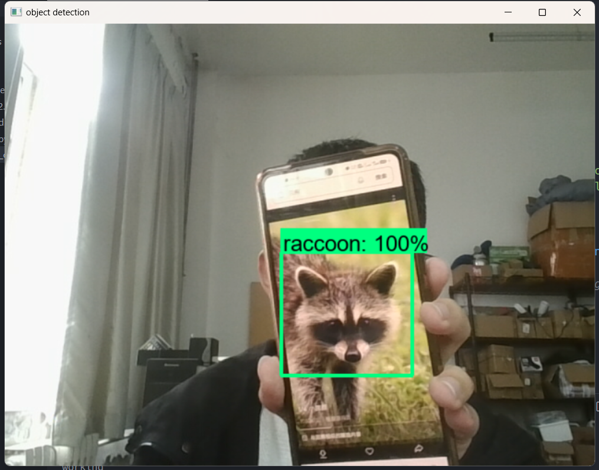

# 训练自定义的对象检测器

**运行环境**：

+ [TensorFlow 2.10.0](https://www.tensorflow.org/install/pip)
+ Windows OS
+ Python 3.9.16
+ 已经安装并能跑通  [TensorFlow Object Detection API](https://github.com/tensorflow/models/blob/master/research/object_detection/g3doc/tf2.md) 的官方测试demo

运行结果如图所示：



## Tensorflow和API的安装

```
# ## Conda ## #
conda create -n tf2 python=3.9	//创建虚拟环境
conda activate tf2	//切换环境
conda install -c conda-forge cudatoolkit=11.2 cudnn=8.1.0	//安装cuda和cudnn加速

# ## Pip ## #
python -m pip install tensorflow==2.10.0	//安装tensorflow
# pip install tensorflow==2.10.0 -i https://pypi.tuna.tsinghua.edu.cn/simple	//可以用清华源
python -c "import tensorflow as tf; print(tf.config.list_physical_devices('GPU'))"	//验证一下GPU
```

```
# ## installation ## #
git clone https://github.com/tensorflow/models.git	//克隆仓库
cp -r models /path/to/tensorflow	//把model文件夹放到tensorflow目录下
cd /path/to/tensorflow/models/research	//切换目录

conda install protobuf	//安装protobuf
protoc object_detection\protos\*.proto --python_out=.	//将*proto文件转换为*.py
cp object_detection\packages\tf2\setup.py .	//复制
pip install .	//安装objcet-detection

# ## test ## #
python object_detection/builders/model_builder_tf2_test.py	//验证测试一下
```


## 本仓库的目录结构

```
training_demo/
├─ annotations/
├─ assets/
├─ exported-models/
├─ images/
│  ├─ test/
│  └─ train/
├─ models/
├─ pre-trained-models/
├─ Scripts/
└─ README.md
```

+ `annotations` 存放所有文件和相应的Tensorflow文件，包括了数据图像的注释表 `*.csv` `*.record`
+ `assets` 存放截图
+ `exported-models` 存放已训练模型的导出版本
+ `images` 存放数据集中所有图像的副本，以及为每个图像生成的相应文件用于注释对象的文件 `*.xml` `labelImg`
+ `models` 将包含每个训练作业的子文件夹。每个子文件夹将包含训练管道配置文件，以及在模型训练和评估期间生成的所有文件 `*.config`
+ `pre-trained-models` 存放预训练模型
+ `Scripts` 存放各个脚本

## 数据集准备

### LabelImg(标注图像)

`pip install labelImg`

生成与图片对应的 `*.xml` 文件

### 创建Tensor Flow Records文件

需要将图片对应的 `*.xml` 文件转换为TensorFlow支持的 `*.record` 格式文件
可以使用目录下的 `generate_tfrecord.py` 脚本进行转换，需要`pandas`包，可以通过pip下载

以下命令目录可以具体替换：

```
python ./Scripts/generate_tfrecord.py -x ./images/train -l ./annotations/label_map.pbtxt -o ./annotations/train.record
```

```
python ./Scripts/generate_tfrecord.py -x ./images/test -l ./annotations/label_map.pbtxt -o ./annotations/test.record
```

## 配置训练任务

### 下载预训练模型

预训练模型可以在[TensorFlow 2 Detection Model Zoo](https://github.com/tensorflow/models/blob/master/research/object_detection/g3doc/tf2_detection_zoo.md)中下载，本次任务选择的是[ssd_mobilenet_v2_fpnlite_640x640](http://download.tensorflow.org/models/object_detection/tf2/20200711/ssd_mobilenet_v2_fpnlite_640x640_coco17_tpu-8.tar.gz)模型，将它下载并在`pre-trained-models`目录下解压. ~~本仓库已经准备好这些了~~

### 修改配置文件

将预训练模型目录下的`pipeline.config`文件复制到`./model/my_ssd_mobile_v2_fpn`目录下并修改为本任务需要的配置文件

本任务只检测了浣熊这一类对象，且训练数据集是从[datitran](https://github.com/datitran/raccoon_dataset)的仓库上拉来的，但是数据标注我自己做了修改。

`pipeline.config`文件有几处需要注意的地方

```
model {
  ssd {
    num_classes: 1	// 改为自己要检测的对象类别数量
    image_resizer {
      fixed_shape_resizer {
        height: 640
        width: 640
      }
    }
    ...
    ...
train_config {
  batch_size: 4	// 根据显存大小修改，为2的倍数
  data_augmentation_options {
    random_horizontal_flip {
    }
  }
    ...
    ...
  fine_tune_checkpoint: "E:\\Johnson_Project\\Tensorflow\\training_demo\\pre-trained-models\\ssd_mobilenet_v2_fpnlite_640x640_coco17_tpu-8\\checkpoint\\ckpt-0"
		// 目录自己具体修改 linux环境下用“/”
  num_steps: 50000	// 学习总步长，可适当修改
  startup_delay_steps: 0.0
  replicas_to_aggregate: 8
  max_number_of_boxes: 100
  unpad_groundtruth_tensors: false
  fine_tune_checkpoint_type: "detection"	// 检测和分类两种任务选择一个
  use_bfloat16: false	// 如果不想用TPU训练，可以设为false
  fine_tune_checkpoint_version: V2
}
train_input_reader {
  label_map_path: "E:\\Johnson_Project\\Tensorflow\\training_demo\\annotations\\label_map.pbtxt"
  tf_record_input_reader {
    input_path: "E:\\Johnson_Project\\Tensorflow\\training_demo\\annotations\\train.record"
  }
}
eval_config {
  metrics_set: "coco_detection_metrics"
  use_moving_averages: false
}
eval_input_reader {
  label_map_path: "E:\\Johnson_Project\\Tensorflow\\training_demo\\annotations\\label_map.pbtxt"
  shuffle: false
  num_epochs: 1
  tf_record_input_reader {
    input_path: "E:\\Johnson_Project\\Tensorflow\\training_demo\\annotations\\test.record"
  }
}
```

~~基本上都是一些目录的问题，毕竟本任务相对简单，其他默认即可~~

## 训练模型

训练模型命令如下

```
python ./Scripts/model_main_tf2.py --model_dir=models/my_ssd_mobile_v2_fpn --pipeline_config_path=models/my_ssd_mobile_v2_fpn/pipeline.config
```

训练时长根据硬件不同，一般不会太短，可以使用`TensorBoard`工具可视化监视训练过程

另外打开一个终端，输入

```
tensorboard --logdir=models/my_ssd_mobile_v2_fpn
```

## 导出训练模型

在当前位置运行如下命令

```
python ./Scripts/exporter_main_v2.py --input_type image_tensor --pipeline_config_path ./models/my_ssd_mobile_v2_fpn/pipeline.config --trained_checkpoint_dir ./models/my_ssd_mobile_v2_fpn/ --output_directory ./exported-models/my_model
```

完成之后会在当前目录下的`exported-models/my_model/`中生成训练好的模型，可以用此模型进行验证

## 模型测试

测试脚本在仓库目录, `object_detection_camera.py`， 需要`opencv`包，一般来说直接在主目录下运行即可，但是可能需要等待漫长的时间(~~我跑了大概1分钟才出画面~~)。~~如果跑不出来注意修改相对路径~~。